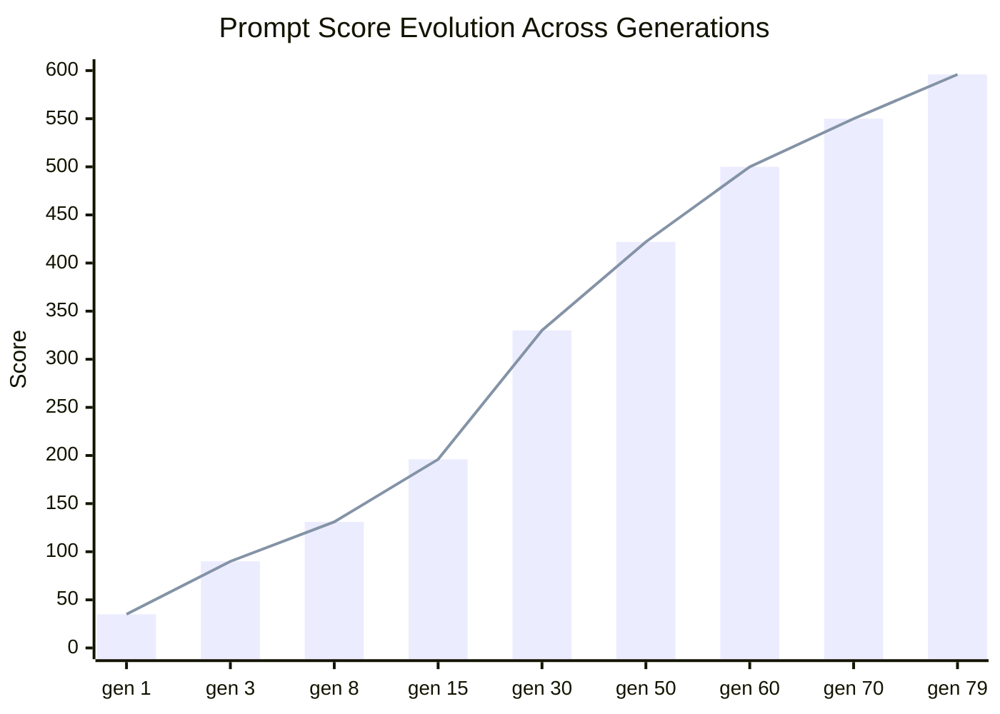

<p align="center">
  <picture>
    <source media="(prefers-color-scheme: dark)" srcset="https://img.shields.io/badge/status-active-success?style=for-the-badge&logo=github&logoColor=white&labelColor=333">
    
  </picture>
  
  
  
  
  
</p>

<h1 align="center">🧬 AutoResearch AI Agent Skeleton</h1>
<p align="center"><strong>Evolutionary prompt optimization for AI agent code generation.</strong></p>

---

This project uses a **genetic algorithm** to automatically evolve prompts that generate better and better AI agent project skeletons. Starting from a simple seed prompt, it iteratively mutates, evaluates, and selects the fittest prompts — treating prompt engineering as a **search problem** rather than a manual craft.

## 🔬 How It Works

The system implements a **"modify → evaluate → keep/revert"** loop, inspired by [Andrej Karpathy's `autoresearch`](https://github.com/karpathy/autoresearch). We applied the same principle to **evolving AI agent prompts** instead of training code.

### The Evolutionary Loop


### Score Progression



### Components

| File | Purpose |
|------|---------|
| `mutate.py` | Creates new prompt variants using four genetic strategies |
| `evaluate.py` | Scores each prompt against 500+ quality signals |
| `reflect.py` | Records rankings, statistics, and observations |
| `run_evolution.sh` | Orchestrates the automated loop: mutate → evaluate → reflect → commit |
| `auto_evolve.py` | Extended evolution that injects new signals into evaluate.py to raise the ceiling |
| `evolve_forever.py` | Aggressive evolution (200+ cycles), injects 400+ deep signals |

### Mutation Strategies

| Strategy | Weight | Description |
|----------|--------|-------------|
| **Append** | 30% | Adds a random quality-improving instruction to the end |
| **Crossover** | 30% | Merges a chunk from another prompt into the current best |
| **Rewrite Section** | 20% | Inserts a new instruction at a random position |
| **Combine** | 20% | Splices the first half of the best prompt with the second half of another |

## 📈 Current Status

- **Latest Generation:** 79
- **Population Size:** 79 prompts
- **Best Score:** 596 (and climbing — ceiling was raised by `auto_evolve.py`)
- **Reflection History:** 4,561 lines covering the full evolution
- **Evaluation Signals:** 500+ quality checks (auto-expanded via signal injection)
- **Score Progression:** 35 → 86 → 140 → 330 → 422 → 500 → 550 → 596

> The evaluation function itself **co-evolves** alongside the prompts. When scores saturated at 500, `auto_evolve.py` injected fresh scoring signals into `evaluate.py` — raising the ceiling and creating new targets for the prompts to optimize toward.

> What elite prompts generate:
> - Full `src/package/` layout with 20+ modules
> - LangGraph ReAct loop + Ollama local models
> - Pydantic v2 config, validation, type hints everywhere
> - Async/await, streaming, SSE/websocket support
> - OpenTelemetry + Prometheus + Grafana observability
> - OAuth2/JWT auth, rate limiting, encryption
> - pytest property-based, snapshot, benchmark, fuzz testing
> - Docker, docker-compose, Kubernetes, systemd deployment
> - Design patterns: factory, strategy, observer, repository, pipeline
> - CI/CD with GitHub Actions + dependabot + pre-commit

📖 [View full evolution history →](reflection.md) *(4,561 lines and counting)*

## 🚀 Quick Start

```bash
# Clone the repo
git clone https://github.com/NullLabTests/autoresearch-ai-agent-skeleton.git
cd autoresearch-ai-agent-skeleton

# Run a single evaluation on the current prompt
python eval.py

# Or run the full evolutionary loop (Linux/macOS)
chmod +x run_evolution.sh
./run_evolution.sh
```

### Using with OpenCode or Cursor

1. Open this repo in OpenCode or Cursor
2. Edit `prompt.txt` to improve it
3. Run `python eval.py` to see if your change improved the score
4. If score goes up → commit. If down → revert.
5. Repeat.

📘 See [`program.md`](program.md) for detailed instructions.

## 📁 Project Structure

```
autoresearch-ai-agent-skeleton/
├── README.md              # This file
├── LICENSE                # MIT license
├── program.md             # Instructions for OpenCode/Cursor
├── prompt.txt             # Seed prompt (outer loop)
├── eval.py                # Simple score evaluator (outer loop)
├── auto_evolve.py         # Automated evolution orchestration
├── mutate.py              # Genetic mutation engine
├── evaluate.py            # 200+ signal scoring engine
├── reflect.py             # Generation reflection & insights
├── run_evolution.sh       # Full automation script
├── reflection.md          # Historical record of all generations
├── results.log            # Latest evaluation results
├── population/            # Evolved prompts (59 and counting)
├── generated/             # Generated outputs
└── .gitignore
```

## 💡 Why This Matters

Prompt engineering is usually a manual, trial-and-error process. This project treats it as a **search problem** — let the computer try thousands of variations, keep what works, discard what doesn't, and let the population evolve toward better solutions. No human intuition required, just a good fitness function and enough generations.

## 🙏 Credits

Inspired by [Andrej Karpathy's `autoresearch`](https://github.com/karpathy/autoresearch), which introduced the elegant "modify → evaluate → keep/revert" loop for autonomous code improvement.

## 📄 License

MIT — see [LICENSE](LICENSE) for details.
