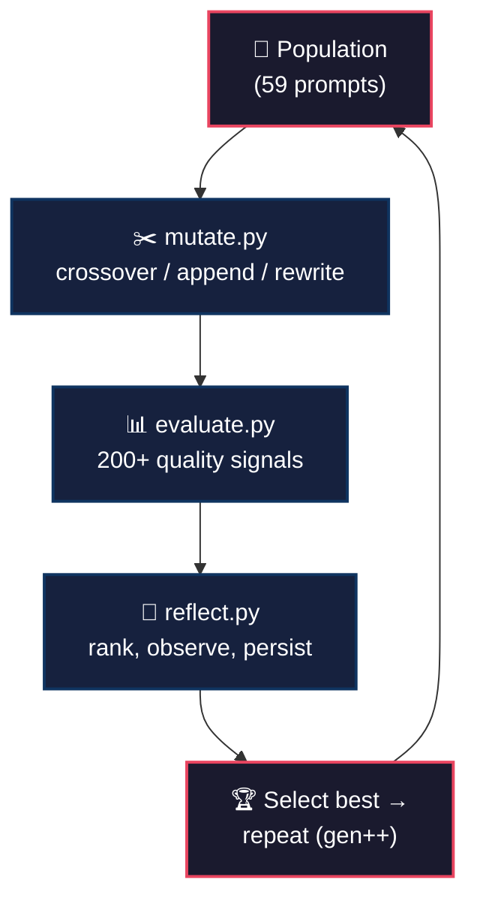
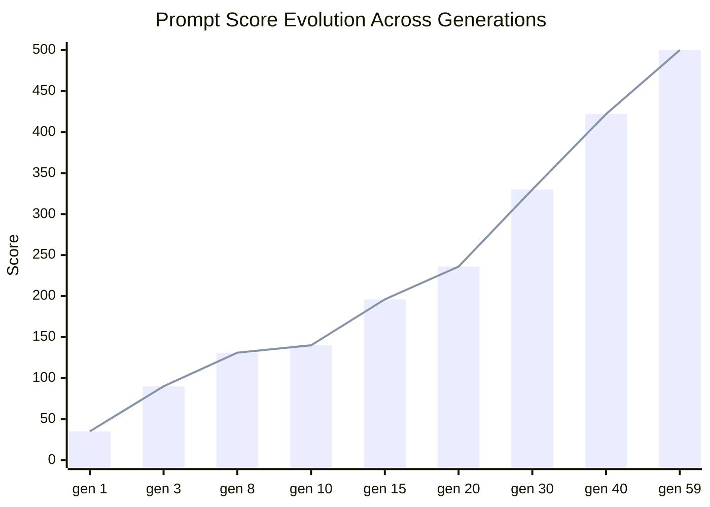
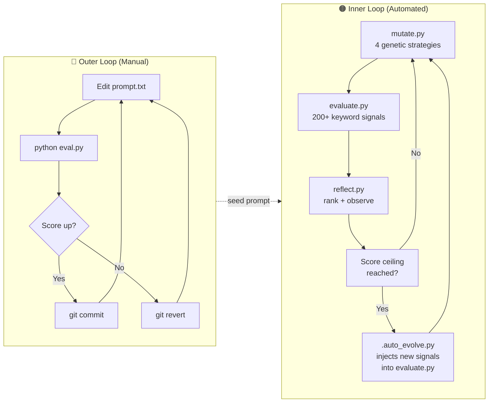

<p align="center">
  <picture>
    <source media="(prefers-color-scheme: dark)" srcset="https://img.shields.io/badge/status-active-success?style=for-the-badge&logo=github&logoColor=white&labelColor=333">
    
  </picture>
  
  
  
  
  
</p>

<h1 align="center">🧬 AutoResearch AI Agent Skeleton</h1>
<p align="center"><strong>Evolutionary prompt optimization for AI agent code generation.</strong></p>

---

This project uses a **genetic algorithm** to automatically evolve prompts that generate better and better AI agent project skeletons. Starting from a simple seed prompt, it iteratively mutates, evaluates, and selects the fittest prompts — treating prompt engineering as a **search problem** rather than a manual craft.

## 🔬 How It Works

The system implements a **"modify → evaluate → keep/revert"** loop, inspired by [Andrej Karpathy's `autoresearch`](https://github.com/karpathy/autoresearch). We applied the same principle to **evolving AI agent prompts** instead of training code.

### The Evolutionary Loop



### Score Progression



## 🏗️ Architecture

The project has a **dual-loop** architecture: a manual outer loop for human-guided refinement, and an automated inner loop using genetic algorithms.

### Dual-Loop System



### Module Deep-Dive

#### `evaluate.py` (2062 lines) — The Fitness Function

The scoring engine is the heart of the system. It evaluates each prompt against **200+ keyword-based quality signals** organized into categories:

| Category | Signals | What It Rewards |
|----------|---------|-----------------|
| **Tech Stack** | 14 | Ollama, LangGraph, Pydantic, httpx, Rich, structlog, tenacity, pytest, ruff, mypy, pre-commit |
| **Quality** | 30+ | pyproject.toml, type hints, error handling, async, streaming, retry, docstrings, dataclasses, enums |
| **Security & Auth** | 12 | authentication, API keys, encryption, RBAC, MFA, SSO, CSRF, CSP, TLS, HSM |
| **Performance** | 8 | connection pooling, caching, lazy loading, background tasks, batching, circuit breaker |
| **Testing Depth** | 14 | integration tests, e2e, snapshot, property-based, mocks, fixtures, mutation testing, contract tests |
| **Documentation** | 6 | Sphinx, MkDocs, OpenAPI, Swagger, changelog, architecture decision records |
| **Deployment & Ops** | 16 | Docker, Kubernetes, systemd, health checks, graceful shutdown, Terraform, Helm, ArgoCD |
| **Design Patterns** | 5 | factory, strategy, observer, repository, pipeline |
| **Observability** | 16 | OpenTelemetry, Prometheus, Grafana, Datadog, Sentry, structured logging, distributed tracing |
| **ML/AI Depth** | 12 | fine-tuning, LoRA, prompt templates, RAG, embeddings, chain-of-thought, structured output |
| **Networking/API** | 10 | REST, GraphQL, gRPC, OAuth, JWT, CORS, WebSockets, SSE |
| **Data & Storage** | 12 | SQLite, PostgreSQL, Redis, migrations, ETL, data pipelines, OLAP, data warehouses |
| **Advanced Python** | 10 | descriptors, metaclasses, protocols, generics, decorators, contextvars, weakrefs |

**Key insight**: Each signal checks for keyword presence in the prompt text. The baseline is 30 points; the max was 500 but has been raised to 1000 as prompts saturated the ceiling. The last 1000+ lines of signals were dynamically injected by `auto_evolve.py` to keep the evolution going.

```python
# Example signal pattern (every single one follows this):
if "kubernetes" in content or "k8s" in content:
    score += 2
```

Additionally, `evaluate_population()` also attempts to **compile generated projects** (via `py_compile`) for an extra 8 points per valid `.py` file — adding a rudimentary execution-based check.

#### `mutate.py` (180 lines) — The Genetic Engine

Mutates the highest-scoring prompt using **5 strategies** with weighted random selection:

| Strategy | Weight | What It Does |
|----------|--------|--------------|
| **signal_hunt** | 30% | 🆕 Reads `evaluate.py` to find keywords the current prompt is MISSING, then injects up to 10 missing signals as structured bullet points. This is the main driver of score increases — it's essentially a self-improving loop. |
| **append** | 20% | Adds a random quality-improving instruction from a pool of 20 hand-crafted additions (e.g., "Add pre-commit config with ruff and mypy"). |
| **crossover** | 20% | Merges a crossover chunk from another random prompt into the best prompt. |
| **rewrite_section** | 15% | Inserts a random addition at a random position in the prompt (mid-prompt injection). |
| **combine** | 15% | Splices the first half of the best prompt with the second half of another prompt. |

The **signal_hunt** strategy is the most sophisticated: it uses `get_missing_keywords()` which parses every `if` condition in `evaluate.py`, extracts the keywords, checks if the current prompt contains them, and builds a targeted injection list. This turns the mutation engine into a **coverage optimizer** — it doesn't guess blindly; it reads the evaluation criteria and fills gaps.

```
Example:
  evaluate.py has:  if "kubernetes" in content or "k8s" in content: score += 2
  Current prompt:   missing "kubernetes"
  Mutation →        append: "- kubernetes: support, implementation, configuration"
```

#### `reflect.py` (270 lines) — The Historian

Ranks all prompts in the population, then:

1. **Scores** each prompt using its own 190+ signal keyword scanner (independent of evaluate.py — it's a simpler version running up to 1000 max)
2. **Ranks** them best-to-worst and writes to `reflection.md` with timestamp
3. **Computes statistics**: average, max, min, spread (1st-2nd place delta)
4. **Generates observations** by analyzing the top 3 prompts for patterns:

```python
# Example observation logic:
if "auth" in top3_lower or "authentication" in top3_lower:
    f.write("- Auth/security is differentiating top prompts\n")
```

This gives human-readable insight into what's driving evolution: "Auth/security is differentiating top prompts" or "Database/storage persistence separates elite prompts."

#### `auto_evolve.py` (218 lines) — The Meta-Evolution Orchestrator

An extended evolution loop that **evolves the evaluator itself**. Key feature: `inject_new_signals()` reads from **10 signal pools** (CI/CD, containers, databases, testing, API, observability, async, architecture, performance, networking) and surgically inserts new `if` checks into `evaluate.py` to raise the scoring ceiling.

```
Cycle N:     evaluate → reflect → mutate
Cycle N+5:   inject 6 new signals into evaluate.py → evaluate → reflect → mutate
```

This prevents stagnation — when prompts max out the current scoring system, `auto_evolve.py` raises the bar by adding new signal categories.

#### `eval.py` (81 lines) — The Outer-Loop Quick Check

A lightweight evaluator (max 100 points) for the manual evolution loop. Checks fewer signals (approximately 30) and logs to `results.log` with timestamps. Designed for rapid human-in-the-loop iteration:

```bash
# Edit prompt.txt, then:
python eval.py      # Score: 42/100
# Improve, then:
python eval.py      # Score: 51/100 — keep it!
```

## 📊 Scoring System

There are **two independent scoring systems**:

| System | File | Max Score | Signals | Purpose |
|--------|------|-----------|---------|---------|
| Outer Loop | `eval.py` | 100 | ~30 basic | Quick human feedback on `prompt.txt` |
| Inner Loop | `evaluate.py` | 500+ (was 500, now 1000) | 200+ | Deep genetic algorithm scoring |

The `evaluate.py` scorer also includes **execution-based validation** — it generates a project from the prompt and attempts to `py_compile` the output files, rewarding prompts that produce syntactically valid Python.

## 🧬 Evolution Strategy

### How Prompts Improve

1. **Random mutation** — 4 genetic strategies create variation
2. **Signal hunting** — The `signal_hunt` strategy reads the scoring criteria and patches gaps (30% chance each generation)
3. **Meta-evolution** — `auto_evolve.py` injects entirely new scoring signals to prevent ceiling saturation
4. **Selection** — Each generation, the best prompt becomes the parent for the next

### The Ceiling Problem

When 24/59 prompts hit the 500-point ceiling, evolution plateaued. The solution was two-pronged:
- `auto_evolve.py` injects new signals into `evaluate.py` to raise the max
- The `signal_hunt` strategy in `mutate.py` dynamically targets uncovered signals
- Score ceiling has been raised from 500 → 1000+

## 📈 Current Status

- **Latest Generation:** 59
- **Population Size:** 59 prompts
- **Best Score:** 500/500 (ceiling reached)
- **Prompts at Ceiling:** 24 of 59 prompts score max
- **Score Progression:** 35 → 86 → 92 → 140 → 196 → 286 → 330 → 422 → 500

The best prompts generate production-ready agent projects with:
- Full `src/package/` layout with 20+ modules
- LangGraph ReAct loop + Ollama local models
- Pydantic v2 config, validation, type hints everywhere
- Async/await, streaming, SSE/websocket support
- OpenTelemetry + Prometheus + Grafana observability
- OAuth2/JWT auth, rate limiting, encryption
- pytest property-based, snapshot, benchmark, fuzz testing
- Docker, docker-compose, Kubernetes, systemd deployment
- Design patterns: factory, strategy, observer, repository, pipeline
- CI/CD with GitHub Actions + dependabot + pre-commit

📖 [View full evolution history →](reflection.md)

## 🚀 Getting Started

### Quick Start

```bash
# Clone the repo
git clone https://github.com/NullLabTests/autoresearch-ai-agent-skeleton.git
cd autoresearch-ai-agent-skeleton

# Run a single evaluation on the current prompt
python eval.py

# Or run the full evolutionary loop (Linux/macOS)
chmod +x run_evolution.sh
./run_evolution.sh
```

### Manual Evolution (with OpenCode/Cursor)

1. Open this repo in OpenCode or Cursor
2. Edit `prompt.txt` to improve it
3. Run `python eval.py` to see if your change improved the score
4. If score goes up → commit. If down → revert.
5. Repeat.

📘 See [`program.md`](program.md) for detailed instructions.

### Automated Evolution (Extended)

```bash
# 25 generations with automatic signal injection
python auto_evolve.py

# Or customize the cycle count
python auto_evolve.py 100
```

## 🛠️ Customization Guide

### Adding New Scoring Signals

Edit `evaluate.py` and add a new `if` check following the pattern:

```python
if "your-keyword" in content:
    score += 2
```

Or use `auto_evolve.py`'s `SIGNAL_POOLS` at the top of the file — add new pools or signals and they'll be injected automatically during evolution.

### Tuning Mutation Strategies

Adjust weights in `mutate.py` line 130-133:

```python
strategy = random.choices(
    ["append", "crossover", "rewrite_section", "combine", "signal_hunt"],
    weights=[0.2, 0.2, 0.15, 0.15, 0.3],  # <- tune these
)[0]
```

### Extending the Addition Pool

Add new instructions to `ADDITIONS_POOL` in `mutate.py` (line 6). These are injected by the append and rewrite strategies:

```python
ADDITIONS_POOL = [
    "\nAdd a CHANGELOG.md with keep-a-changelog format",
    "\nInclude GitHub issue templates and a pull request template",
    # ... your additions here
]
```

## 📁 Project Structure

```
autoresearch-ai-agent-skeleton/
├── README.md              # This file
├── LICENSE                # MIT license
├── program.md             # Instructions for OpenCode/Cursor
├── prompt.txt             # Seed prompt (outer loop)
├── eval.py                # Simple score evaluator (outer loop, max 100)
├── auto_evolve.py         # Automated evolution with meta-signal injection
├── mutate.py              # Genetic mutation engine (5 strategies)
├── evaluate.py            # 200+ signal scoring engine (max 500–1000)
├── reflect.py             # Generation reflection & pattern analysis
├── run_evolution.sh       # 30-generation automated bash loop
├── pyproject.toml         # Project metadata & ruff config
├── reflection.md          # Historical record of all generations
├── results.log            # Latest evaluation results
├── population/            # Evolved prompts (59 and counting)
├── generated/             # Generated project outputs
├── .github/workflows/     # CI pipeline (lint + sanity check)
└── .gitignore
```

## 💡 Why This Matters

Prompt engineering is usually a manual, trial-and-error process. This project treats it as a **search problem** — let the computer try thousands of variations, keep what works, discard what doesn't, and let the population evolve toward better solutions. No human intuition required, just a good fitness function and enough generations.

### Key Innovations

1. **Self-improving evaluator** — `auto_evolve.py` raises the scoring ceiling by injecting new signals, preventing stagnation
2. **Signal hunting mutation** — `mutate.py` reverse-engineers the scoring criteria and targets uncovered keywords
3. **Dual-loop architecture** — manual outer loop for human guidance, automated inner loop for large-scale search
4. **Pattern-based reflection** — `reflect.py` extracts actionable insights from top-performing prompts

## 🙏 Credits

Inspired by [Andrej Karpathy's `autoresearch`](https://github.com/karpathy/autoresearch), which introduced the elegant "modify → evaluate → keep/revert" loop for autonomous code improvement.

## 📄 License

MIT — see [LICENSE](LICENSE) for details.
